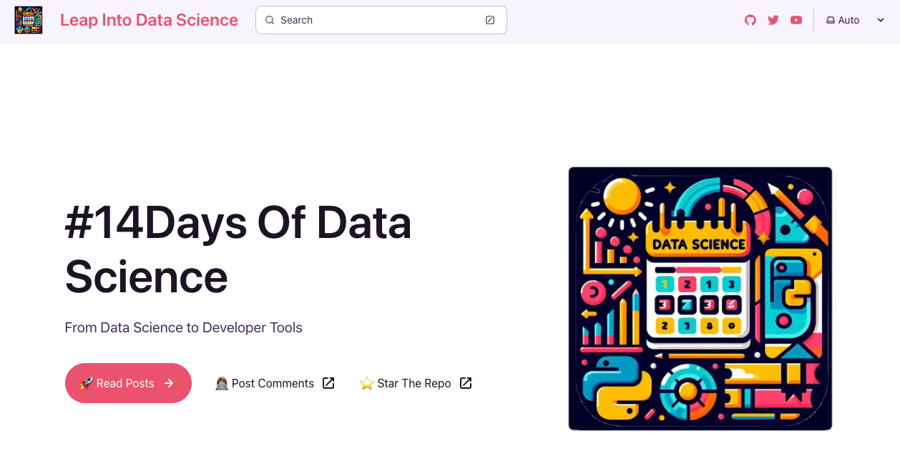

# Leap into Data Science


| |
|:---|
|Welcome to #14DaysOf Data Science, a 2-week series of posts that will help you make the **Leap into Data Science** from fundamental concepts to developer tooling.  |
||


 - **Read The Posts** 👉🏽 [GitHub Website](https://aka.ms/2024/data-science-recipes)
 - **Post Your Comments** 👉🏽 [dev.to series](https://dev.to/reneenoble/series/26710)
 - **Continue Learning** 👉🏽 [Learn Collection](https://bit.ly/2024-datasci-collection)


## 1. Learning Objectives

- Understand core Data Science Concepts
- Explore core Data Science Tools
- Learn to Analyze & Visualize Data with AI help
- Learn to Debug & Assess Models for Responsible AI
- Build your intuition & skills with hands-on exercises

## 2. Astro Starlight Setup

The GitHub website is built using [Astro Starlight](https://starlight.astro.build/getting-started/) and hosted on GitHub Pages using an automated GitHub Action workflow.  Check out [docs/README.md](./docs/README.md) for more details.

The repository is instrumented with a `devcontainer.json` file setup to support Node.js and Python development runtimes. 

To preview the documentation, just open the repo in GitHub Codespaces, wait till you see the Visual Studio Code terminal prompt, then enter:

```bash
cd docs
npm install
npm run dev
```