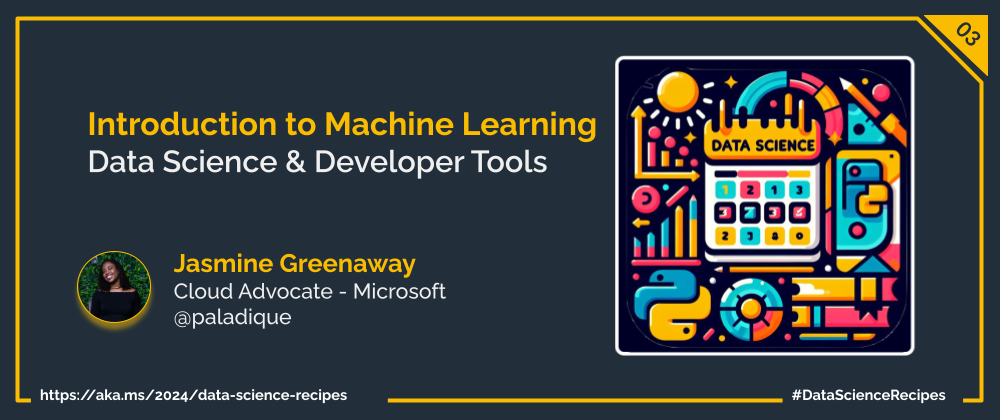

Welcome to week  `Day 03` of **Foundations of Data Science Week**. Today, we delve into a a topic a lot of people will have heard about, but not necessarily understand, Machine Learning. You probably interact with Machine Learning Models everyday wihtout realising, whether it's advertising in social media trying to show you the next item you should purchase, to autocorrect helping you send text messages, to email filters keeping your inbox spam free. The applicaitons of Machine Learning are endless and today we'll discuss the basics of how they work. 

|  ](./img/machine-learning.png) |
| :----------------------------------------------------------------------------------------------------: |
|
Image by [Manfred Steger](https://pixabay.com/users/manfredsteger-1848497) from [Pixabay](https://pixabay.com/)            |

# Introduction to Machine Learning

Machine Learning is a subfield of Data Science and is at the heart of many AI technologies that have become popular in recent years. Machine Learning covers a broad range of techniques and algorithms that train a computational models using some combination or mathematics and statstics. 

The training process is much like any human learning process, where from previous experiences, data, and patterns we learn to identify patterns that enable us to solve future problems. With a well trained Machine Learning model, predictions or decisions can be made programmatically without explicitly programming the logic or answers that the model can return to the user. 

But much like any person's knowledge, a Machine Learning model is only as good as the training it has received, so ensuring that training data is of a high quality is essential to creating a robust Machine Learing module that you can reliably count on for predicting future outcomes. 

## Understanding the Types of Machine Learning

Machine learning can be broadly categorized into three main types: supervised learning, unsupervised learning, and reinforcement learning. In supervised learning, algorithms learn from labelled data to make predictions or classifications. Unsupervised learning, on the other hand, involves extracting patterns and structures from unlabelled data. Reinforcement learning focuses on models that learn through trial and error as they interact with examples or real-world scenarios as they work towards optimising towards a set goal.

## Applications of Machine Learning**

The applications of machine learning span across various domains, ranging from healthcare and finance to environmental science and entertainment. In healthcare, machine learning algorithms analyze medical images, predict disease outcomes, and personalize treatment plans. In finance, they aid in fraud detection, risk assessment, and algorithmic trading. In environmental  science, they can be used to predict patterns  in the climate. In entertainment, recommendation systems utilize machine learning to deliver personalized media recommendations to viewers.

## The Machine Learning Workflow**

The machine learning workflows involve several key stages, including data collection, data preprocessing, model training, model evaluation, and deployment. 

**Data Collection:**
During data collection, relevant and representative datasets are gathered and prepared for analysis. 

**Data Preprocessing:**
Data preprocessing involves cleaning, transforming, and preparing the data to be ingested by the model during training. 

**Model Training:**
Model training entails selecting an appropriate algorithm, training the model on the data, and optimizing its performance. 

**Model Evaluation:**
Model evaluation assesses the model's accuracy and it's ability to generalize on unseen data. 

**Deployment:**
Finally, successful models are deployed into production environments for real-world applications.

Here's the corrected version:

## What do you need in order to get started with Machine Learning?

The world of Machine Learning has been evolving for decades. It is getting easier to get involved, while the possible applications of Machine Learning are growing. 

Since there are so many things you can do with Machine Learning, there are a lot of different things you might need for your specific project *(but you won't need to know everything!)*. However, three things that anyone looking to use Machine Learning should consider are understanding your data, access to computing power to run algorithms, and knowing the limitations of Machine Learning technology.

**Understand your data**  
The quality of the predictions that any Machine Learning model depends heavily on the data that is put into it. To use Machine Learning, you'll need to perform feature selection to identify types of data that are relevant to what you are trying to predict. It is important to investigate your data and see what it is like before putting it into a Machine Learning algorithm. 

You may want to perform some statistical analysis to see if the data is as you would expect. This will help you identify missing data, data that is not an accurate representation of the data the model will encounter in the real world, and will help you remove unnecessary dimensions from your data that add noise or bias to the model. For these reasons, it is important to have a subject matter expert involved in Machine Learning processes. 

**Run your algorithms**  
There are lots of options for running Machine Learning algorithms, whether you want to run them locally on your computer or utilize Cloud computing services to leverage more powerful machines.

If you want to write your own code, you have the option to use a variety of libraries in Python, like Pandas, SciKitLearn, and NumPy to work with your data and access a variety of Machine Learning functions. If you are using a small enough data set you can run this on your own computer, or if you want a more scalable option or to deploy a Machine Learning module that others can use, you can use a cloud service like [Azure Machine Learning](https://azure.microsoft.com/en-au/products/machine-learning/). 

If you prefer a drag-and-drop editor for working with your data and creating workflows, you can use [Azure Machine Learning Designer](https://azure.microsoft.com/en-au/products/machine-learning/designer/#product-overview), which can then also be deployed for others to access. 

**Know the limitations of Machine Learning**  
While Machine Learning can seem like a magic solution to all kinds of problems, it is important to have some understanding of the statistical principles that the algorithms operate on. At the end of the day, Machine Learning isn't magic; it's just mathematics!

There are a lot of different machine learning algorithms and you'll need a cursory understanding of them to work out which algorithm is best for your scenario and data. Once you have chosen an algorithm delve in a bit further to understand how it works. Even if you choose the perfect algorithm it is still essential to get to know your data, to validate the predictions the model makes are sensible, and to consider if it is responsible to use Machine Learning for your application at all or if you should also include some sort of human sign-off as part of your process.

## What's next?
Tomorrow we'll take a closer look at Supervise Machine Learning where we'll discuss when you might want to, how to use it, and what kind of data you'll need.

## Learn More

- Get started with Machine Learning in [Fundamentals of Machine Learning](https://aka.ms/python/DataScienceDay/ML-Fundamentals) on Microsoft Learn.

## More Data Science at Microsoft

- [Check out the Data Science Cloud Skills Challenge](https://aka.ms/python/DataScienceDay/CSC) if you want to go through some self-paced learning! This challenge is active until April 15th, 2024.
- Join us on Discord at https://aka.ms/python-discord
- [Data Scientist Certifications](https://aka.ms/python/DataScienceDay/DataScience-certification)
- [Data Scientist Training Path](https://aka.ms/python/DataScienceDay/DataScience-TrainingPath)

<!-- for DEV.TO
---
title: Introduction to Machine Learning
published: false
description:
tags: data science, machine learning, python
series: 14 Days of Data Science
canonical_url: https://aka.ms/
cover_image:
--- -->

---

---