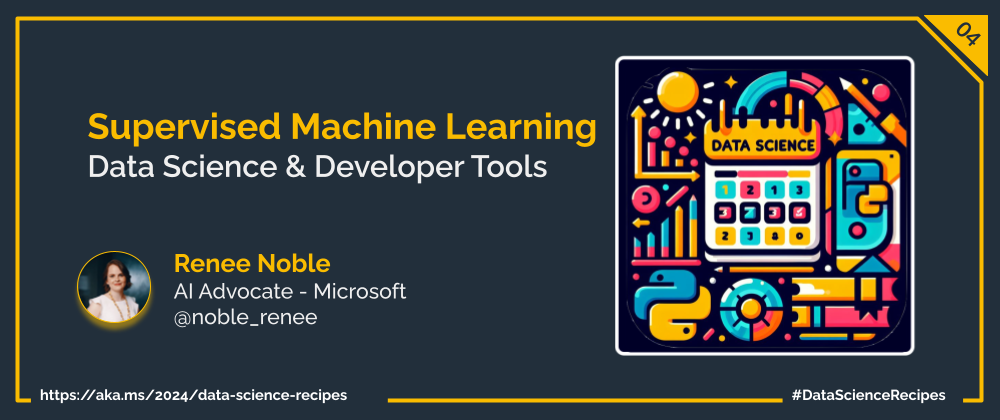

Welcome to week  `Day 04` of **Foundations of Data Science Week**. Today's topic is Supervised Machine Learning. Even if you've never heard of it before, you'll be familiar with the idea. Just like going to school where students are taught when things are correct or incorract, and they learn to figure out the answers to new problems *(like the ones they see on their exams!)*. 

Attribution<a href=https://pixabay.com/users/alexandra_koch-621802/  style="color:grey; font-size:8px"> Alexandra_kock</a>

Supervised Machine Learning follows this same idea by providing labeled training data to a chosen algorithm. This is data where we know the various inputs as well as the output. For instance, our data set could contain various features of different dog like height, length, tail length, etc. The data we use for training or model would also have the output we want to train our model to predict, the bread of dog. The goal is to be able to provide the trained model new inputs and for it to predict the bread of dog.

Attribution<a href=https://pixabay.com/users/dandelion_tea-15261675/  style="color:grey; font-size:8px"> dandelion_tea</a>

## What is ***Supervised*** Machine Learning?
Supervised Machine Learning is a core concept in AI, where algorithms learn from labeled data to make predictions or decisions. The data provided for training includes both input features and corresponding output labels. The goal is to teach the algorithm to recognize patterns in the data so it can generalize and make predictions on new, unseen data. 

Tasks like classification (predicting categories) and regression (predicting values) fall under supervised learning. It's used in various fields like image recognition, identifying spam emails, and more. The success of supervised learning hinges on having high-quality labeled data and selecting suitable algorithms and models

## When and how to use supervised Machine Learning?

Supervised machine learning is most appropriate when you have labeled data available and want to train models to make predictions or classifications based on that data. It is commonly used in scenarios where historical data contains examples of both input features and corresponding output labels. 

### Data Prepartion
1. **Collect data** 
Start by collecting and preprocessing a labeled dataset, ensuring it is representative of the full breadth of data that could be seen when considering this problem. 

2. **Data Cleaning** 
Data cleaning involves identifying and rectifying errors, inconsistencies and anomalies in the dataset to improve its quality and reliability for analysis. This can involve handling missing values, removing duplicates, addressing outliers, transforming data, and ensuring data consistency and accuracy.

3. **Feature selection** 
Feature selection involves the process of identifying and choosing the most relevant features from a dataset to improve model performance and reduce overfitting. It entails evaluating the importance or relevance of each feature using statistical methods, domain knowledge, or automated algorithms and selecting a subset of features that contribute most significantly to the predictive task at hand.    
Additionally, it's crucial to consider potential biases in the data, such as unequal representation of certain features, which can impact the effectiveness and fairness of the selected features and the resulting model. It is important to get to know your data and understand the real world biases that could be embedded within it.

### Algorithm Selection

There are many types of Supervised Machine Learning algorithms that are suited to different kinds of problems, for instance regression or classification. The type of algorithm you choose will depend on factors like the relationships within the data *(is the relationship with the output linear?)*, the number of groups you want to categorise things into *(is it binary? or are there more categories?)*, and the complexitiy of the relationships within the data *(does your project require deep learning?)*

Some of the different algorithms you should consider are: Decission Trees and Random Forests, Neural Networks, Linear Regression, Logisitc Regression, and Support Vector Machines. 

### Model Creation
The process of creating a model involves three steps, Train, Test, and Tune. 

As part of the process data is segmented so that different data is used in the different stages. This way data that has been explicitly used in the training of the algorithm isn't used later in the testing, since the model will already have seen the expected answer. 

1. **Train** 
During training, a portion of the labeled dataset (the training set) is used to teach the machine learning model to make predictions or classifications. The model learns from the input features and corresponding output labels, adjusting its internal parameters to minimize the error between its predictions and the true labels. 

2. **Test** 
After training the model, you evaluate its performance on a separate portion of the dataset called the test set. The test set contains examples that the model has not seen during training, allowing you to assess the model's predictions compared to the expect output values. 

3. **Tune** 
In the tuning step, you fine-tune the model's hyperparameters, parameters that control the algorithm, or optimization algorithms to improve its performance further. The process involves experimenting with different combinations of hyperparameters and selecting the ones that yield the best performance on the validation set. 

## Pros and Cons of using Supervise Machine Learning
### Pros 
1. **Effective for Predictive Tasks:** 
Supervised learning is highly effective for predictive tasks where the goal is to make accurate predictions or classifications based on known labeled data.

2. **Interpretability:** 
Some supervised learning algorithms, such as decision trees and linear models, offer interpretable models. This means you can look into the relationships between input features and output labels and unerstand how the the model is making its predictions.

3. **Availability of Labeled Data:** 
In many real-world scenarios, labeled data is readily available or can be obtained relatively easily, making supervised learning a practical approach.

4. **Performance** 
With proper preprocessing, feature engineering, and model selection, supervised learning algorithms can achieve high levels of performance and accuracy on a wide range of tasks.

### Cons
1. **Dependence on Labeled Data:** 
Supervised learning relies on labeled data for training, which can be expensive and time-consuming to obtain. In some cases, labeled data may be scarce or incomplete, limiting the effectiveness of supervised learning models.

2. **Overfitting:** 
Overfitting can occur where the model learns to memorize the training data instead of generalizing from it. This can happen if the model is too complex relative to the amount of data available for training. This is especially true if the training data is not representative of the entire population or if the underlying data distribution changes over time.

3. **Bias and Fairness:** 
Supervised learning models may inherit biases present in the training data, leading to unfair or discriminatory outcomes, especially in sensitive applications like hiring, lending, and criminal justice. It is important to consider ethical AI whenever choosing data for any type of Machine Learning training.

4. **Model Complexity:** 
Some supervised learning algorithms, particularly deep learning models, can be computationally expensive and require substantial computational resources for training and inference.

## What's Next?

Tomorrow, you'll explore another side of Machine Learning when we take a look at unsupervised machine learning and how you can use that. 

## Learn More

- Read more about Machine Learning and how to create Supervised Machine Learning models in [The Understand data science for machine learning learning path](https://learn.microsoft.com/en-us/training/paths/understand-machine-learning/) Microsoft Learn pathway.

## More Data Science at Microsoft

- [Check out the Data Science Cloud Skills Challenge](https://aka.ms/python/DataScienceDay/CSC) if you want to go through some self-paced learning! This challenge is active until April 15th, 2024.
- Join us on Discord at https://aka.ms/python-discord
- [Data Scientist Certifications](https://aka.ms/python/DataScienceDay/DataScience-certification)
- [Data Scientist Training Path](https://aka.ms/python/DataScienceDay/DataScience-TrainingPath)

<!-- for DEV.TO
---
title: Supervised Machine Learning
published: false
description:
tags: data science, machine learning, python
series: 14 Days of Data Science
canonical_url: https://aka.ms/
cover_image:
--- -->

---

---