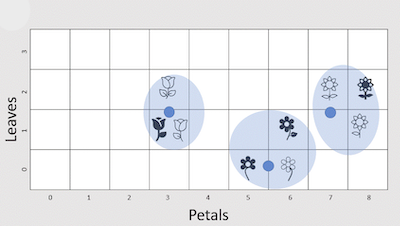
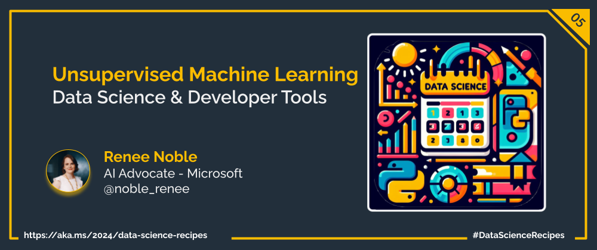

Welcome to week  `Day 05` of **Foundations of Data Science Week**. Today, we will look at Unsupervised Machine Learning, how it differs from Supervise Machine Learning and we'll discuss how it can find inherint patterns beyond the abilities of humans.

## What is ***Unsupervised*** Machine Learning?
Unsupervised Machine Learning is the process of using algorithms to find hidden patterns in data when there is not labelled data available to train an algorithm on. Instead of being told what to look for, unsupervised algorithms autonomously sift through data, seeking inherent patterns, relationships, and structures.

|  |
|:---:|
|         |
 |

Allowing algorithms to identify patterns and clusters autonomously offers a unique approach to uncovering hidden structures and relationships within data, particularly data sets with many dimensions. This makes it particularly well-suited for exploratory data analysis, work with images, and anomaly detection tasks where it can infer normal and abnormal behaviours from statistical distributions in unlabelled data.

## When would I want to use Unsupervised Machine Learning?

Labelled data sets aren't always available or easy to create, especially at the scale you might need to train a generalizable model. Unsupervised Machine Learning is here to help in those situations, where there just isn't enough labelled data, or it isn't of a high quality. Unsupervised Machine Learning is also the go to technique if you don't quite know what you are looking for but want to uncover hidden relationships.

Three key areas that Unsupervised Machine Learning is used in are clustering, dimensionality reduction, and anomaly detection. 

### Clustering

A key factor in human intelligence is being able to identify groups of similar items. Using Unsupervised clustering algorithms computers can mathematically recreate this process by grouping similar data points together in a multi-dimensional feature space, without the need for labelled output. One popular algorithm is K-means clustering, which partitions the dataset into a predetermined number of clusters, each represented by a centroid that minimizes the distance between itself and the data points within the cluster. For example, in customer segmentation, K-means clustering can group customers based on their purchasing behavior, allowing businesses to tailor marketing strategies to different segments. This unsupervised approach enables organizations to uncover natural groupings within their data, and creating dedicated strategies to enhance the experience for each kind of customer. 

Once the algorithm has determined best clustering for the specified number of clusters, you can calculate how well that clustering fits the data, as compared to a different specified number of clusters. Trying different numbers of clusters may help identify the true number of clusters in which all data points are well grouped around the centroid of their given cluster. Identifying the best number of clusters can also help identify hidden groups that may be conflated with other groups unless a high enough number of clusters are allocated. For our customer segmentation example, this process could reveal more niche segments that are then easier to target such as budget-conscious customers, family-oriented customers, or health and wellness seekers. If you only allowed for a limited number of clusters, you could likely end up with clusters based mostly on age or gender. 

### Dimensionality Reduction
Ever feel overwhelmed by the sheer volume of data at your disposal and don't know which features to include? Unsupervised learning has the perfect solution: dimensionality reduction. This technique simplifies complex datasets by distilling them down to their essential components while preserving as much valuable information as possible. It's like condensing a lengthy epic novel into a concise summary without losing the plot.

In high-dimensional datasets where the number of features exceeds the number of observations, unsupervised learning techniques like principal component analysis (PCA) or t-distributed stochastic neighbor embedding (t-SNE) can be used to reduce the dataset's dimensionality while preserving as much relevant information as possible. By simplifying complexity, dimensionality reduction empowers us to gain deeper insights and visualize data in a more intuitive manner.

**Principal Component Analysis (PCA)** 
By identifying the principal components that capture the most variation, PCA can simplify complex datasets and reveal underlying structures. PCA is widely used in data visualization, feature extraction, and noise reduction in various domains, including image processing, genetics, and finance. PCA is widely used in data visualization, feature extraction, and noise reduction in various domains, including image processing, genetics, and finance. 
 
**t-Distributed Stochastic Neighbor Embedding (t-SNE)** 
t-SNE is a nonlinear dimensionality reduction technique that emphasizes the preservation of local similarities in high-dimensional data when projecting it into a lower-dimensional space. Unlike PCA, t-SNE is well-suited for visualizing complex, nonlinear relationships in data, making it popular for exploratory data analysis and visualization tasks. t-SNE is commonly used in natural language processing, image recognition, and biological data analysis.

### Anomaly Detection
Unsupervised Machine Learning is strongly rooted in mathematics and statistics, with models being developed by observing distributions and correlations in large quantities of multi-dimensional data. With models built on up an understanding of what is to be expected, an understanding of what is not expect becomes innate to the model as well, enabling outliers and anomalies lurking within datasets to be easily flagged. This enables Unsupervised Machine Learning algorithms to be used to flag anomalies indicative of fraudulent transactions, unusual sensor readings, or rare genetic mutations. 

One of the key strengths of Unsupervised Machine Learning in anomaly detection lies in its scalability. While some anomaly detection tasks may be conceivable for humans, the sheer scale at which they need to be performed renders them unattainable. Take, for instance, the detection of fraudulent transactions. While a human analyst may be capable of identifying fraudulent patterns when presented with the data, the relentless frequency of cybercrimes involving fraudulent transactions daily, coupled with the time-intensive process of data ingestion and comparison against broader datasets, renders this task far more efficiently executed by Unsupervised Machine Learning algorithms.

Conversely, there exist tasks that transcend the realms of human cognition, particularly in terms of the vast quantities of data required for anomaly detection. Consider the detection of anomalies in genetic sequences, where the sheer volume of genomic data to be processed surpasses human capability. Ingesting a single genome, let alone thousands or millions, presents a monumental challenge beyond human capacity, making it an ideal domain for Unsupervised Machine Learning algorithms to thrive.

By delving into these nuanced aspects, Unsupervised Machine Learning not only enhances anomaly detection but also reshapes our understanding of data analysis in an increasingly complex and interconnected world.
 

## What's Next?
Tomorrow we'll explore the Data Science life cycle, and the steps taken to transform a raw collection of data into meaningful information and insights.

## Learn More
Learn how to [Train and evaluate clustering models](https://aka.ms/python/DataScienceDay/UnsupervisedML) in this Microsoft Learn Module.

## More Data Science at Microsoft

- [Check out the Data Science Cloud Skills Challenge](https://aka.ms/python/DataScienceDay/CSC) if you want to go through some self-paced learning! This challenge is active until April 15th, 2024.
- Join us on Discord at https://aka.ms/python-discord
- [Data Scientist Certifications](https://aka.ms/python/DataScienceDay/DataScience-certification)
- [Data Scientist Training Path](https://aka.ms/python/DataScienceDay/DataScience-TrainingPath)

<!-- for DEV.TO
---
title: Unsupervised Machine Learning
published: false
description: 
tags: datascience, machinelearning, python
series: 14 Days of Data Science
canonical_url: https://aka.ms/
cover_image:
--- -->

---

---

