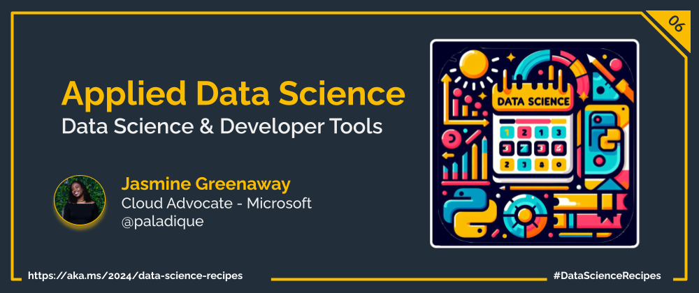

Welcome to week  `Day 06` of **Foundations of Data Science Week**. Today, we will walk through the data science lifecycle: an essential roadmap for transforming raw data into meaningful insights.

| ](./img/sketchnote-ds-lifecycle.png)|
|:---:|
| Introduction to the Data Science Lifecycle - _Sketchnote by [@nitya](https://twitter.com/nitya)_ |

Data science isn’t just about crunching numbers; it’s a journey, from problem framing to actionable insights. At its core it's a process, and can be broken down into 5 stages.

## Capturing: What's the problem?

Data scientists must frame the problem they aim to solve clarity on the problem statement is crucial.
This stage involves defining the problem as a question, understanding its context, and aligning it with organizational goals.

Once the problem has been accurately captured, then next is the process of data collection. Identifying the problem at hand enables data scientists to capture high-quality data, which is the backbone of any successful data science project.

## Processing: Where do we go from here?

The processing stage of the lifecycle is where the magic happens! Here, data is transformed into actionable insights. Most of this step is centered around discovering patterns in the data as well as applying machine learning models. However, there's additional techniques that take place in this step. Some of the tasks performed in this step are:

- **Data Cleaning and Transformation:** Alter, or mold the data to make it uniform without errors or inaccuracies and more suitable for analysis. For instance, converting decimal numbers into currency.
- **Dimensionality Reduction**: Simplifying the model by removing excessive data that can create uncessacary model complexity.
- **Sampling**: Capturing a subset of data to make computations faster and manageable.
- **Model Selection and Tuning**: There's a vast number of options for selecting the right model, which are evaluated using metrics like accuracy, precision, and recall.
- **Model Training and Evaluation**: Training models on prepared data and evaluating their performance to ensure accuracy and reliability.

## Analysis: What does the data tell us?

The analysis stage is where data scientists dive deep into the processed data, and apply data analysis techniques to uncover the hidden patterns, trends, and correlations.

- **Insight Generation**: Extracting and articulating insights from the model outcomes, which involves understanding the why behind the predictions or classifications made by the models.
- **Data Visualization**: Creating visual representations of the analysis results to communicate findings clearly and effectively.
- **Exploratory Data Analysis (EDA)**: Technique used  to understand and summarize the main characteristics of a dataset, often visually.

## Communication: How do we share the insights with everyone?

The goal of the communication stage is to bridge the gap between data analysis and actionable insights, making complex findings accessible and understandable to stakeholders not directly involved in the data work. It entails:

**Reporting**: Crafting comprehensive reports that summarize findings in an accessible manner.
**Presentations**: Conveying insights through presentations, emphasizing key points and actionable recommendations with compelling storytelling.

## Maintenance: How do we ensure longevity?

The maintenance stage focuses on sustaining the project's value over time through:

**Performance Monitoring**: Keeping an eye on the model’s performance to ensure its predictions remain relevant.
**Data Security**: Keeping the data secure through limiting access to only those who need it, adhering to local laws and regulations.
**Updating Models**: Refining and retraining models to adapt to new data or changes in underlying patterns.
**Feedback Loop**: Utilizing stakeholder and user feedback to continuously improve the model’s accuracy and effectiveness.

## What's Next?

Tomorrow is a brief introduction to the tools data scientists use, and details about [Data Science Day](https://aka.ms/Python/DataScienceDay)!

## Learn More

- [Data Science for Beginners: Data Visualization](https://aka.ms/python/DataScienceDay/DataViz)
- [Data Science for Beginners: Data Science Lifecycle](https://aka.ms/python/DataScienceDay/DataScienceLifecycle)
- [The Team Data Science Process lifecycle (TDSP)](https://aka.ms/python/DataScienceDay/TDSP)

## More Data Science at Microsoft

- [Check out the Data Science Cloud Skills Challenge](https://aka.ms/python/DataScienceDay/CSC) if you want to go through some self-paced learning! This challenge is active until April 15th, 2024.
- Join us on Discord at https://aka.ms/python-discord
- [Data Scientist Certifications](https://learn.microsoft.com/credentials/certifications/roles/data-scientist)
- [Data Scientist Training Path](https://learn.microsoft.com/training/career-paths/data-scientist)

<!-- for DEV.TO
---
title: The Data Science Lifecycle
published: false
description: Explore the the data science lifecycle, a roadmap for transforming data into meaningful insights.
tags: data science, machine learning, python
series: 14 Days of Data Science
canonical_url: https://aka.ms/2024/data-science-recipes

cover_image: 
--- -->

---

---