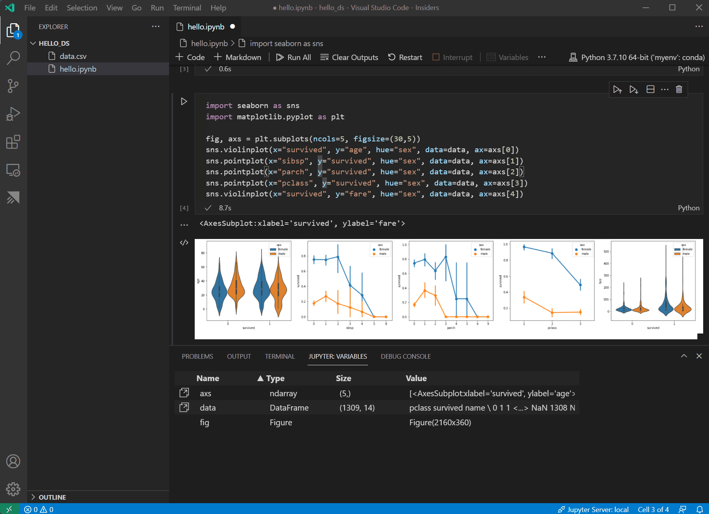
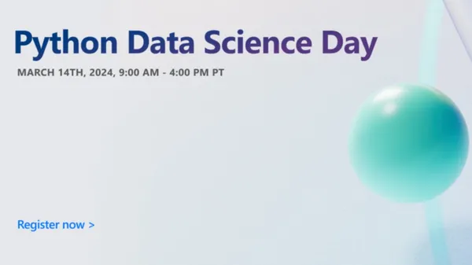
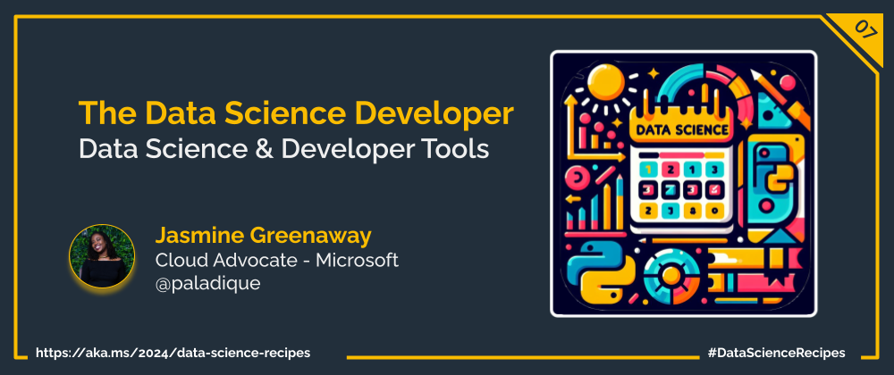

Welcome to week  `Day 07` of **Foundations of Data Science Week**. Today, we will explore tools used by data scientists and learn about what to expect at Data Science day.

# The Data Science Developer Experience

Data science isn't just about having sharp analytical skills; the tools you use can really change how you tackle problems, accelerate the generation of insights, and make it easier to share what you've discovered.

## Tools for Coding

Visual Studio Code (VS Code) is a versatile code editor that supports a multitude of programming languages, including those commonly used in data science such as Python and R. To enhance its capabilities for data science, there are several extensions you can install:

**Python Extension**: Offers comprehensive coding support for Python, including IntelliSense, linting, debugging, and code navigation.

**Jupyter Extension**: Enables you to directly create, edit, and run Jupyter notebooks within VS Code. Jupyter Notebooks are an interactive computing platform where you can combine code execution, text, mathematics, plots, and other visual media. This tool is perfect for tasks like exploratory data analysis (EDA), data cleaning, statistical modeling, and visualization.

## Tools for Analysis

**Pandas and NumPy**: Pandas and NumPy are foundational Python libraries for data science. Pandas provide high-level data structures and functions designed for practical data analysis and manipulation, while NumPy offers comprehensive mathematical functions, random number generators, linear algebra routines, Fourier transforms, and more.

**Matplotlib and Seaborn**: Visualizing data is crucial for understanding complex datasets. Matplotlib and Seaborn are two Python libraries that offer a wide range of tools for creating static, animated, and interactive visualizations.

**Scikit-learn for Machine Learning**: When it comes to building predictive models, Scikit-learn is a Python library for  building predictive models. It features a wide array of supervised and unsupervised learning algorithms, tools for model fitting, data preprocessing, model selection, and evaluation, designed for ease of use and flexibility.

## Try it out yourself: Your first Data Science project in Visual Studio Code

In the following tutorial, you'll dive hands-on into the tools we've discussed in this series, experiencing firsthand some of the key data science tasks we've explored. This interactive session will not only solidify your understanding of these concepts but also prepare you for our next series of posts. There, we'll delve deeper into how to harness these tools' full potential and more, advancing your data science journey.

[Data Science in VS Code tutorial](https://code.visualstudio.com/docs/datascience/data-science-tutorial)

Don't forget that you can continue to build on your skills in the [Data Science Cloud Skills Challenge](https://aka.ms/python/DataScienceDay/CSC)!

## Welcome to Data Science Day! 🎉

Python Data Science Day is a fantastic opportunity for Python developers, entrepreneurs, data scientists, students, and researchers to come together and explore modern solutions for data pipelines and complex queries.

The Python Data Science Day will feature a variety of sessions and lightning talks from experts in the field. Whether you’re interested in high-level programming topics or diving deep into specific features, there’s something for everyone. You'll be introduced to a variety of products and services, like the Data Science workload in Microsoft Fabric and Semantic Kernel SDK. You'll also learn more about data science techniques like data preparation, data analysis, and practical applications of these techniques.

We hope you can join us and interact with data science community in the chat. Missed a session? You'll be able to catch the recordings of anything you missed.

## What's Next?

Now that you've learned basic fundamentals, you'll continue your data science journey in the next series of posts, focused on leveling up your skills with hands on tutorials.

## More Data Science at Microsoft

- [Check out the Data Science Cloud Skills Challenge](https://aka.ms/python/DataScienceDay/CSC) if you want to go through some self-paced learning! This challenge is active until April 15th, 2024.
- Join us on Discord at https://aka.ms/python-discord
- [Data Scientist Certifications](https://aka.ms/python/DataScienceDay/DataScience-certification)
- [Data Scientist Training Path](https://aka.ms/python/DataScienceDay/DataScience-TrainingPath)

<!-- for DEV.TO
---
title: The Data Science Developer Experience
published: false
description: Explore the tools used by data scientists and learn about what to expect at Data Science day.
tags: datascience, machinelearning, python
series: 14 Days of Data Science
canonical_url: https://aka.ms/2024/data-science-recipes
cover_image: 
--- -->

---

---