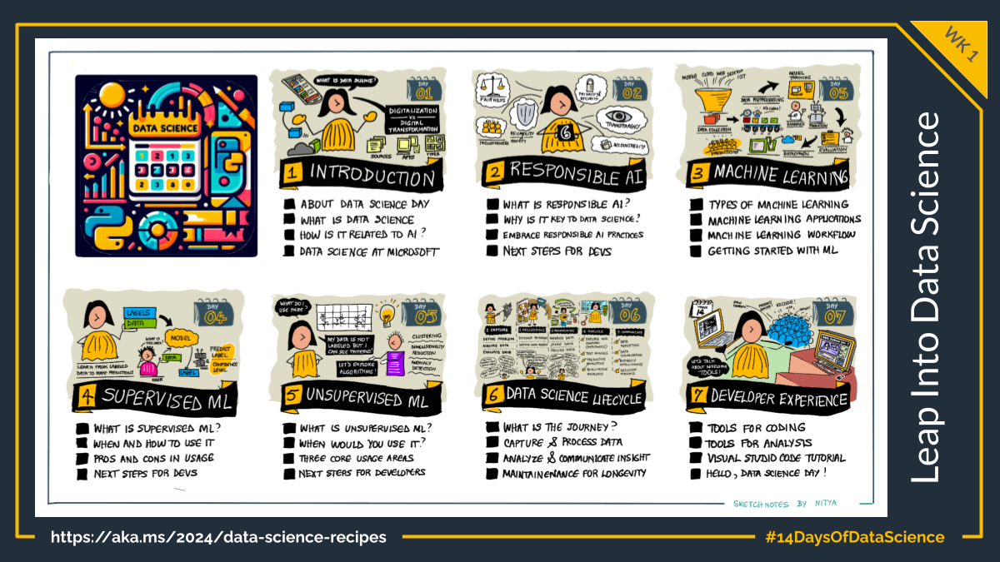

Welcome to week 1 of the data science learning journey. We'll kick off the Data Science journey with a look at foundational concepts from Machine Learning to Developer Experience. By the end of this week, you should have a good understanding of the _Data Science Lifecycle_ and the developer experience for building machine learning applications.

| Day | Topic | Description |
|:---|:---|:---|
| 1️⃣ | [**Introduction to Data Science**](1-introduction-data-science/) | Learn Core Concepts |
| 2️⃣ | [**Responsible AI in Data Science**](2-responsible-ai/) | Understand Six Principles |
| 3️⃣ | [**Introduction to Machine Learning**](3-introduction-machine-learning/) | Explore ML Applications |
| 4️⃣ | [**Supervised Machine Learning**](4-supervised-machine-learning/) | Definition & Workflow  |
| 5️⃣ | [**Unsupervised Machine Learning**](5-unsupervised-machine-learning/) | Definition & Workflow |
| 6️⃣ | [**Data Science Lifecycle**](6-data-science-lifecycle/) | End-to-End Development  |
| 7️⃣ | [**Data Science Developer Experience**](6-data-science-lifecycle/) |  Coding & Analysis Tools|
| | | |

Here's an illustrated guide to Week 1:

## Further Reading

Check out these resources for self-guided learning during this event:
1. [Data Science Day Cloud Skills Challenge](https://aka.ms/python/DataScienceDay/CSC)
1. [Data Science For Beginners Curricula](https://aka.ms/python/DataScienceDay/DataScienceBeginners-curriculum)
1. [Python Community Discord](https://aka.ms/python-discord)