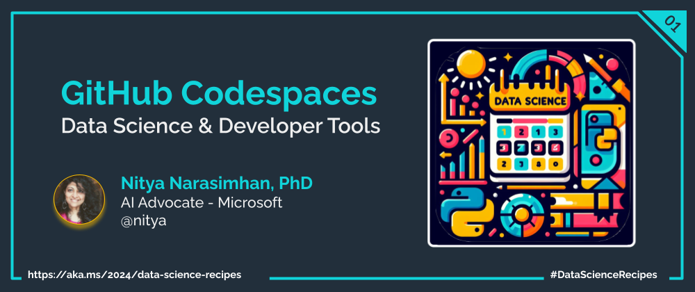

Welcome to `Day 01` of **Developer Tools Week** in our Data Science Day journey. Today, let's talk about how we can setup and use pre-built development environments for productivity and convenience in learning.

## What We'll Learn
1. What are Dev Containers?
1. What are Jupyter Notebooks?
1. Why use GitHub Codespaces?
1. Using Codespaces-Jupyter Template
1. **Assignment**: `TODO: TRY THIS`
1. **Resources**: Explore the [2024: Data Science Day Collection](https://bit.ly/2024-datasci-collection)

---

---