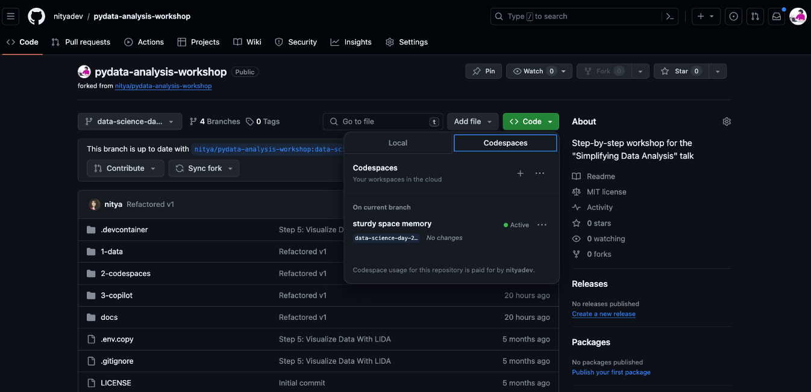
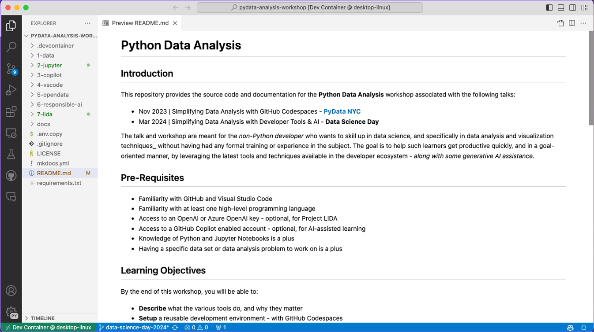
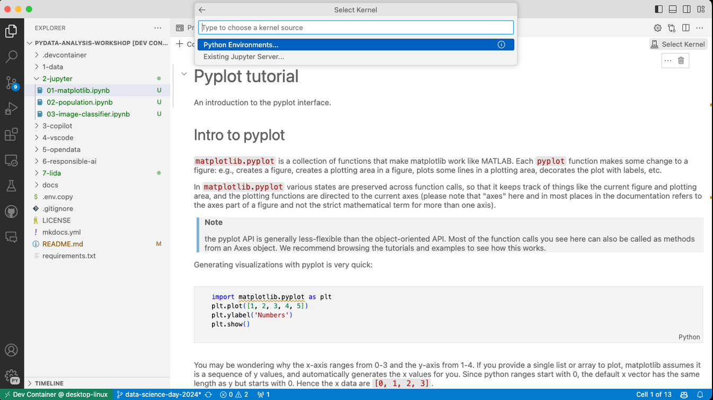
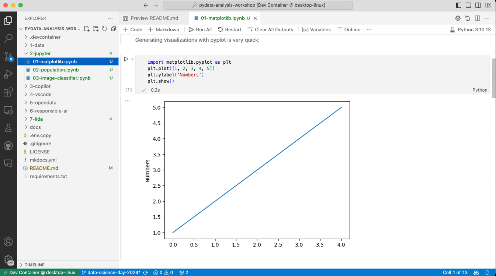

Welcome to the first post of **Developer Tools Week** in our  #14DaysOfDataScience journey. Today, let's talk about how we can setup and use pre-built development environments for productivity and convenience in learning.

## What We'll Learn
1. What are Dev Containers?
1. Why use GitHub Codespaces?
1. What are Jupyter Notebooks?
1. Using Codespaces-Jupyter Template
1. **Assignment**: [Fork the repo](https://aka.ms/workshops/python-data-analysis). Explore notebooks under `2-jupyter/`.
1. **Resources**: Explore the [2024: Data Science Day Collection](https://bit.ly/2024-datasci-collection)

---

## It's Developer Tools Week!!

Welcome to Developer Tools Week on #14DaysOfDataScience. 

Before we dive into the detail of today's post, let's set the stage for _what_ we'll cover this week, and why. The main goal is to jumpstart our learning journey into _data analysis and visualizaton_ (even if we lack expertise in data science or Python) by using developer tools and AI to fill in the gaps in knowledge and intuition. And, we want to use a **goal-oriented approach to learning** where we don't boil the ocean (by trying learn everything) but instead focus on learning what we need, when we need it, to get things done.

To be successful, we need our development environment to be:
 - **Frictionless** - I should be able to setup and get productive quickly. No more _"it works on my machine"_ comparisons. It just works for everyone.
 - **Focused** - I should be able to ask question and solve issues without leaving my development environment. No more _"I'll Google it"_ distractions.
 - **Friendly** - I should be able to share my environment with others, and collaborate with them in real-time. No more _"I'll send you a screenshot"_ explanations.

In my [talk at Python Data Science Day](https://youtu.be/scvDXfCMHYU?t=3770), I outlined a roadmap for this journey, with an exercise for each step, as shown below. Today, we'll start that journey by exploring steps `01` and `02` in the roadmap.

## What are Dev Containers?

A [dev container](https://containers.dev/) is a Docker container that can be configured from a `devcontainer.json` file, which in turn can be checked into your repository for version controlled usage, alongside your code. This allows you to define a consistent development environment that just works out of the box, and works the same way for everyone who launches it from your codebase.

## Why use GitHub Codespaces?

The figure below [give an overview of GitHub Codespaces](https://docs.github.com/en/codespaces/overview?apiversion=2022-11-28), a development environment that **hosts the devcontainer in the cloud**, allowing you to connect to it from a _Visual Studio Code_ editor in your browser, or on your desktop. Simple open a repository in GitHub, click the `Code` button, navigate to the `Codespaces` tab, and launch a new instance - to get a pre-built dev environment with no added effort. 

You can use the [same dev container configuration on your local device](https://code.visualstudio.com/docs/devcontainers/containers) with Docker Desktop. But GitHub Codespaces has three added benefits:
 - **Cloud-hosted** - This means I can connect to the environment from anywhere, including mobile or tablet devices, with nothing more than a modern browser.
 - **Codespaces secrets** - Store environment variables (e.g., API keys) as Codespaces secrets associated with repositories _to limit risk of exposure_.
 - **Collaboration** - We can collaborate with others knowing that our setup is identical (including host hardware) - and can easily scale up our resource needs (CPU, storage) for the task without local hardware constraints.

## What are Jupyter Notebooks?

Having a dev container makes our setup frictionless, but how can we make the learning journey _friendly_ for collaboration with others? This is where [Jupyter Notebooks](https://jupyter.org/) can help. They provide an interactive environment that combines code (Python cell) with documentation (markdown cells) - and is a popular tool for data scientists to capture insights and provide step-by-step guidance for replicating their work. GitHub Codespaces uses Visual Studio Code as the default editor, giving us [excellent built-in support for Jupyter Notebooks](https://code.visualstudio.com/docs/datascience/jupyter-notebooks) to make usage more frictionless.

## Using Codespaces-Jupyter Template

Excellent - we've established that using a GitHub Codespaces (dev container) environment with a Visual Studio Code (editor) and Jupyter Notebooks (interactive code and docs) is the way to go. So .. _where should we start?_.

Turns out GitHub has a great [codespaces-jupyter](https://github.com/github/codespaces-jupyter) template that comes with out-of-the-box support for a data-science ready dev container configuration _and three sample notebooks_ to jumpstart your learning.
I use this template in the [workshop repo](https://aka.ms/workshops/python-data-analysis) I setup for this series - under the [data-science-day-2024](https://github.com/nitya/pydata-analysis-workshop/tree/data-science-day-2024) branch. Let's explore that next. To get started:
1. Fork the [workshop repo](https://aka.ms/workshops/python-data-analysis) to your GitHub account. Make sure you have the `main branch only` unchecked so you get all the branches.
2. Switch to the `data-science-day-2024` branch then launch Codespaces as shown below, directly in the browser.

3. Alternatively, clone the repo to your local device, make sure you have Docker Desktop running, then follow [these instructions](https://code.visualstudio.com/docs/devcontainers/containers#_quick-start-open-an-existing-folder-in-a-container) to open it in a local container. 
4. Either way, once the container is ready, you should see a view like this showing a Visual Studio Code editor with that repo source already loaded.

You are now ready to start exploring the notebooks under `2-jupyter/` and complete the associated exercises. To run a notebook the first time, open it in the editor - then `Select Kernel`, pick the Python Environments option and select the default choice. Here's what that looks like for the 

Next, run the notebook (using `Run All`) to execute the code as shown. Note the three kinds of content visible in this notebook - markdown cells (for documentation), code cells (for Python code) and output cells (for results).

The `matplotlib` notebook teaches you to use that library for basic 2D plotting, while the `population` notebook introduces you to the `pandas` library for data manipulation, using tabular data loaded from a CSV file. 

The `image-classifier` notebook shows you [how to do machine learning in Codespaces](https://docs.github.com/codespaces/developing-in-a-codespace/getting-started-with-github-codespaces-for-machine-learning) by training and testing a simple image classifier.

## **Assignment**: 

We covered a lot of ground today. Now it's your turn to go out and try exploring GitHub Codespaces with Jupyter Notebooks for data analysis.

The repository should now have an fourth notebook (`exercise`) that you can use as a sandbox for experiments. Look at the example in there - then create your own code and markdown cells to try other ideas with different data.

`TODO: TRY THIS`