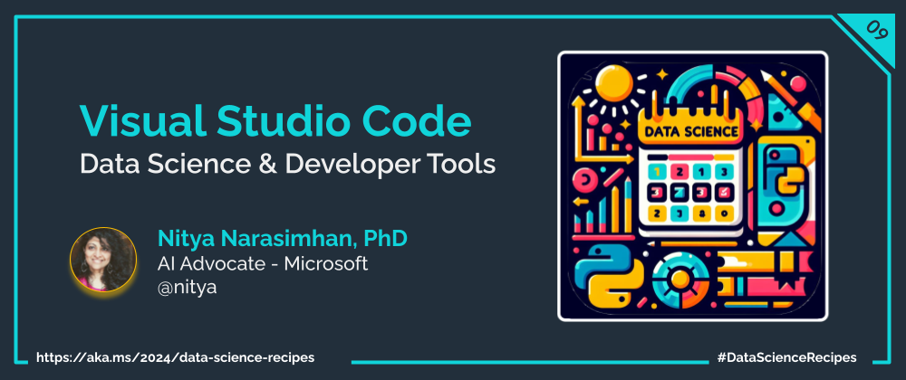
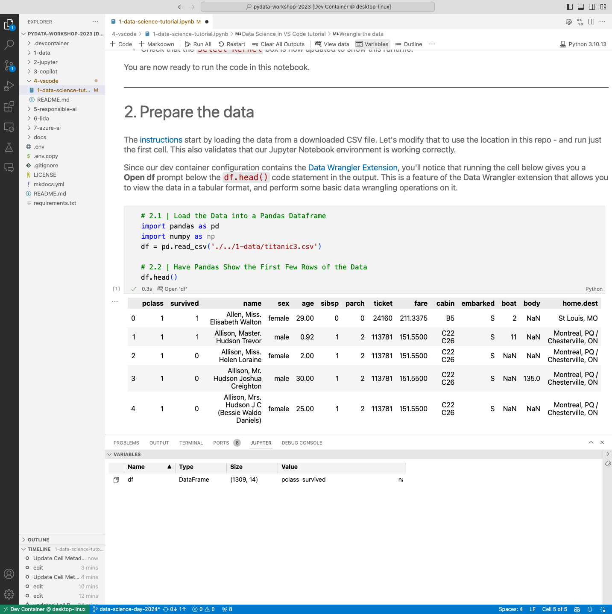
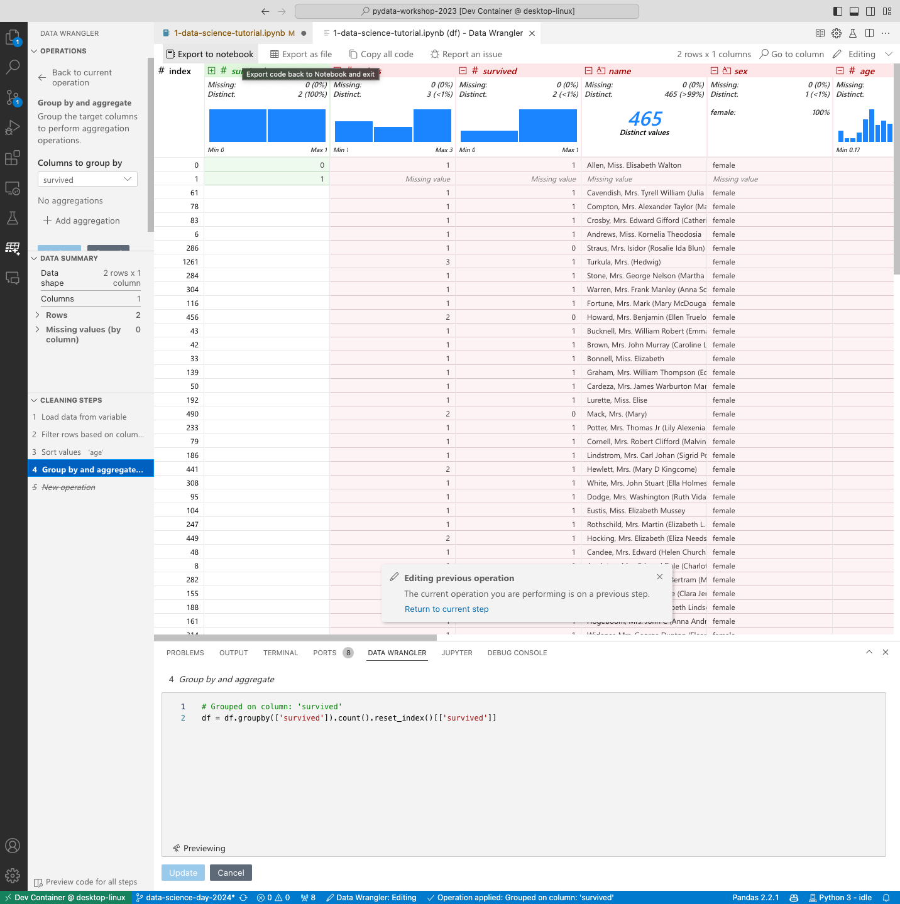
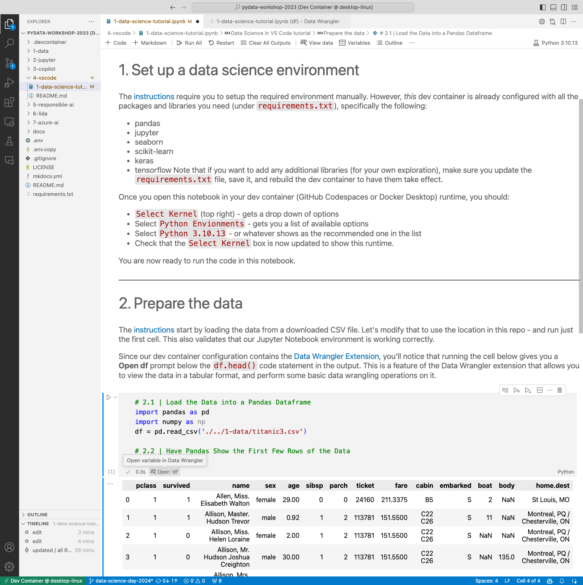

Welcome to the second post of **Developer Tools Week** as we continue our learning journey into Data Science! Today, let's talk about how we can get more productive by using Visual Studio Code as our editor, and creating a _Data Science Profile_ for consistency and collaboration across projects and users.

## What We'll Learn
1. Why use Visual Studio Code?
1. What is a VS Code Profile?
1. How do I create a Data Science Profile?
1. What is Data Wrangler?
1. How can I use Data Wrangler for Data Analysis?
1. **Assignment**: Complete the [Data Science in VS Code Tutorial](https://code.visualstudio.com/docs/datascience/data-science-tutorial)
1. **Resources**: Explore the [2024: Data Science Day Collection](https://bit.ly/2024-datasci-collection)

---

In the last post we talked about [GitHub Codespaces](/data-science-day/week-2/1-codespaces/) and how it helps create a reproducible development environment with minimal setup effort on your part. Today, we'll look at why [Visual Studio Code] (https://code.visualstudio.com/docs) is the perfect _IDE_ (editor) for your data science projects in this environment.

## 1. Why Visual Studio Code?

We already saw how the dev container approach involved a [Visual Studio Code client](https://code.visualstudio.com/docs/devcontainers/containers) (in browser or on local device) connecting to a pre-built Docker container (hosted in GitHub Codespaces or Docker Desktop) to give us a familiar and seamless developer experience. But there are three more reasons why it's ideal for Data Science projects:
1. [Jupyter Notebooks](https://code.visualstudio.com/docs/datascience/jupyter-notebooks) are supported natively in VS Code, making it easy to run and debug code in notebooks in a familiar environment.
2. [VS Code Profiles](https://code.visualstudio.com/docs/editor/profiles) let you create a reusable profile (defining settings, extensions and customizations) that can be shared across projects and users.
3. [Data Wrangler](https://code.visualstudio.com/docs/datascience/data-wrangler) is a code-centric data viewing and cleaning tool with a rich UI to view, clean & analyze data, and automatically generate Pandas code to perform the same operations.

Let's explore these capabilities briefly in the next couple of sections, then revisit the Visual Studio Code tutorial for data science [using the Jupyter-Codespaces environment](/data-science-day/week-2/1-codespaces/) we set up in our workshop repository in the previous post.

## 2. Data Science Profile

If you are a frequent user of Visual Studio Code (e.g., content creation, programming in other languages, working with GitHub Codespaces) then you likely have [Profiles](https://code.visualstudio.com/docs/editor/profiles#_data-science-profile-template) setup for distinct contexts, to make you productive. By default, a profile lets you specify the settings, extensions and other customizations you want to use _for a given context_ in a manner that is **reusable and shareable** across users and projects.

You can create a profile from the Command Palette (as shown above) or by clicking the gear icon in your sidebar and selecting the `Profiles (Default)` menu option. Once created, you can easily switch between profiles with a single click, making it easier to keep _distinct yet customized_ editing preferences and dependencies for each project or domain you work in. You can also _export_ profiles to either a Gist (online) or a file (local device) that others can then _import_ to replicate your settings. 

Visual Studio Code comes with [_curated profile templates_](https://code.visualstudio.com/docs/editor/profiles#_profile-templates) that are pre-configured for popular extensions and capabilities, that you can use as the basis for creating your own. For example, the [`Data Science` profile template](https://code.visualstudio.com/docs/editor/profiles#_data-science-profile-template) has built-in support for Dev Containers, Jupyter, Python, GitHub Copilot, Data Wrangler etc, - giving us the solid foundation required for use in our Jupyter-Codespaces environment.

## 3. Data Wrangler Extension

You may have observed that the Data Science Profile has a [Data Wrangler Extension](https://code.visualstudio.com/docs/datascience/data-wrangler) included by default. What is it and why should we care? Data Wrangler is a code-centric tool for data viewing, cleaning and analyzing - that works seamlessly with data files you open in Visual Studio Code.

More importantly, it can automatically generate Pandas code to perform the same operations you perform in the UI, with easy ways to copy the code into a Jupyter Notebook or clipboard, to simplify your data analysis workflow even further. As a bonus, the extension automatically creates action buttons _within your Jupyter Notebooks_ in contexts where a Pandas DataFrame is returned. 

Clicking this opens a new Data Wrangler view as shown, allowing you to _visually and interactively_ run operations to clean, filter, sort and analyze your data - before exporting generated code back to the Jupyter notebook into a Python cell exactly where you need it. This is a great way to _learn_ core Pandas operations for data cleaning, and build intuition around the _right_ operations to use for your data. **And**, it allows you to document and share these steps with others in a reproducible manner.

## 4. Data Science Tutorial

Let's bring all these elements together and see how Visual Studio Code works _in practice_ for enhanching our Data Science journey. First, take a minute to [review the Data Science section](https://code.visualstudio.com/docs/datascience/overview) of the Visual Studio Code documentation.

Then, review the [Data Science in VS Code Tutorial](https://code.visualstudio.com/docs/datascience/data-science-tutorial) to get a sense of what you will learn by completing these steps [using the Jupyter-Codespaces environment](/data-science-day/week-2/1-codespaces/) we set up earlier. The tutorial covers four stages of a data science workflow that we can adapt to our needs:
 - **Setup your environment** - we'll use our Jupyter-Codespaces template
 - **Prepare the data** - we'll launch Data Wrangler from the notebook
 - **Train & evaluate** - using scikit-learn (we'll revisit later)
 - **Use a neural network** - using Keras and TensorFlow (we'll revisit later)

To make this easier, I've created a [data-science-tutorial](https://github.com/nitya/pydata-analysis-workshop/blob/main/4-vscode/1-data-science-tutorial.ipynb) notebook under the `4-vscode/` folder in the workshop repository with the first two stages of the tutorial completed as shown. Observe how the `df.head()` output now shows a `Data Wrangler` button below that launches the `Data Wrangler` view when clicked.

Here is a screesnhot showing how we can switch the Data Wrangler into _Editing_ view, to perform operations on the data (e.g., sort, filter, group). These operations are recorded as **Cleaning Steps** (see sidebar lower left), with the code for each step auto-generated in the Data Wrangler pane (bottom, right). and then _Export_ the generated code back to the notebook. When the steps are complete, then **Export to notebook** (see menu option, top) to get the code automatically inserted into a Python code cell in the notebook.

Use the notebook as a sandbox to explore various operations interactively on the data file - and observe how the Pandas code generated matches the requirement.

## 5. Assignment: Try it out!

It's your turn. [Fork the repo](https://github.com/nitya/pydata-analysis-workshop/tree/main), launch it in GitHub Codespaces, then open the `4-vscode
/1-data-science-tutorial.ipynb` notebook. You should see something like this - but with `Select Kernel` at the top right. 
    - First, "Clear all outputs" to start fresh
    - Then, "Select Kernel" and chose the default Python environment
    - Then "Run All" to view the outputs from each cell.

By completing the tutorial, you will not only get a good understanding of the steps involved in each stage, but you will end up with a notebook template you can reuse with other datasets, to experiment further and build your intuition.

_In our next post, we'll explore the use of GitHub Copilot to automate the generation of notebooks, get explanations for code - and suggestions to build our intuition organicially - using this tutorial as a basis._