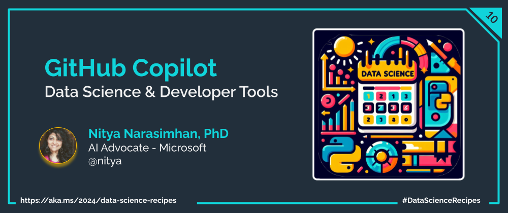

Welcome to `Day 03` of **Developer Tools Week** as we continue our learning journey into Data Science! Today, let's talk about the GitHub Copilot extension and how we can use it for _focused learning_ inline, or in chat mode.

## What We'll Learn
1. What is GitHub Copilot?
1. Create Notebooks with Copilot
1. Explore Concepts with Copilot
1. Visualize Data with Copilot
1. **Assignment**: `TODO: TRY THIS`
1. **Resources**: Explore the [2024: Data Science Day Collection](https://bit.ly/2024-datasci-collection)

---

---