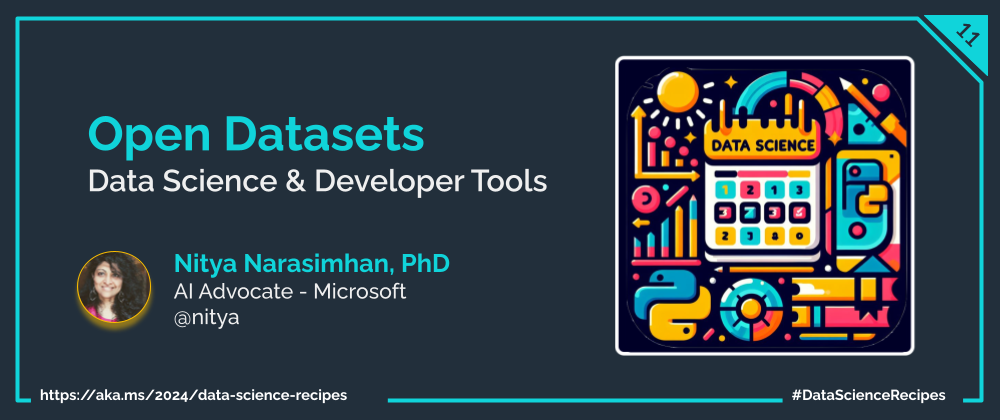

Welcome to `Day 04` of **Developer Tools Week** as we continue our learning journey into Data Science! Today, let's talk about finding inspiration from the open source community by exploring open datasets and learning resources.

## What We'll Learn
1. What is [Exploratory Data Analysis (EDA](https://learn.microsoft.com/ai/playbook/capabilities/experimentation/exploratory-data-analysis)?
1. Explore Datasets on [Kaggle](https://www.kaggle.com/datasets).
1. Explore Datasets on [Hugging Face](https://huggingface.co/datasets).
1. Explore Datasets on [Microsoft Azure](https://learn.microsoft.com/azure/open-datasets/)
1. **Assignment**: Enrich data [with Azure Open Datasets](https://learn.microsoft.com/azure/open-datasets/samples?view=azureml-api-1)
1. **Resources**: Explore the [2024: Data Science Day Collection](https://bit.ly/2024-datasci-collection)

---

In previous posts, we walked through tools to set up a consistent pre-built development environment, and establish a Data Science profile for productive coding. Now that we have our developer tools in place, let's talk about what _explorataory data analysis_ involves  and how we can practice this approach with open datasets.

## 1. What is Exploratory Data Analysis (EDA)?

Once you have a dataset, the first step is to _analyze_ it in a way that helps you understand its main characteristics. This is where **Exploratory Data Analysis (EDA)** comes in. It's an approach that uses visualization tools and techniques to help us understand the data, identify patterns, and relationships between variables, and detect outliers or missing values. This process can then guide us in making necessary decisions to build a predictive model with that data.

A typical EDA workflow involves:
 - Loading data into a data frame
 - Cleaning data by handling missing values and outliers
 - Visualizing data using plots and charts
 - Analyzing data to identify patterns and relationships
 - Summarizing data to draw insights

To understand how this works, it helps to have a real data set to work with - and then create a Jupyter notebook to walk through these steps interactively. But finding good datasets for data science work can be challenging. This is where open datasets come in handy.

## 2. Open Datasets & Communities

Open datasets are _publicly available datasets_ that are curated by community or organizations, and shared for use in research and learning projects. They typically cover a wide range of real-world application domains from finance and healthcare, to environment and sports - giving learners like us a rich source of data and inspiration to practice our data science skills.

One of the side-benefits of open datasets is the community that forms around them, that you can learn from. Want to get a sense for what an exploratory data analysis is? Find a community-authored notebook for an open dataset, and study it to get familiar with the libraries used, the visualizations created, and the insights drawn from the data. Then, pick a new dataset and work through the steps on your own.

Let's look at three of my favorite sources for open datasets and community-driven learning.

## 2. Datasets on Kaggle

[Kaggle](https://www.kaggle.com/datasets) is one of the most popular platforms and communities for machine learning and data science _learners, developers and researchers_. According to the site, it currently has 18M+ users, 309K datasets, 1M+ notebooks and 2.5K+ trained models - all shared by the community. As a learner, there are some features that are particularly helpful:
 - [Community Notebooks](https://www.kaggle.com/notebooks): Members share their work in public notebooks, which you can then study, run on their platform, and discuss with others - to build your own intuition.
 - [Co-hosted Competitions](https://www.kaggle.com/competitions): Kaggle is known for data science compeititions that can challenge you to build your skillset by applying what you learn to real-world problems.
 - [Certification Courses](https://www.kaggle.com/learn): Structured courses that guide you through various skills needed for data science projects, with an option to get certifications for your professional profile.

Learn data analysis by doing exercises with real datasets. For instance, I am a huge fan of cricket (sport). So here are three steps I can take to get started on a data analysis journey for cricket data: 
 1. Find a dataset - This [IPL 2022-Dataset](https://www.kaggle.com/datasets/aravindas01/ipl-2022dataset) looked interesting.
 1. Explore notebooks - This [Community EDA Tutorial](https://www.kaggle.com/code/aravindas01/eda-and-data-visualization-tutorial) inspired me.
 1. Explore models - This [Score Prediction Model](https://www.kaggle.com/code/coolboyraghu/ipl-score-prediction) gave me ideas.

Now, I can build my intuition by running and remixing these notebooks - or apply my learnings to new datasets, transferring that knowledge.

## 3. Datasets on Hugging Face

While Kaggle focuses on the broader data science community, [Hugging Face](https://huggingface.co/) targets more advanced learners and researchers with a community that is focused on natural language processing (NLP), deep learning and generative AI. The platform provides a hub for finding models, datasets, and Spaces (hosted demos) created by the community.

Here are three resources to explore first on Hugging Face:
 - [Datasets](https://huggingface.co/datasets): Find datasets shared by the community for use in machine learning tasks like text classification, image classification, object detection, text retrieval, question answering and more.
 - [Datasets Library](https://huggingface.co/docs/datasets/index): A Python library for streamlining data processing tasks for training machine learning models.
 - [Quickstart Tutorial](https://huggingface.co/docs/datasets/tutorial) to guide you through the steps of using the library with a published dataset. And extensive [how-to guides](https://huggingface.co/docs/datasets/how_to) to handle more complex tasks building on those fundamentals.
 
 
## 4. Datasets on Microsoft Azure

As you progress in your data science journey, you will also need to understand how to _operationalize_ your data science workflows - from enriching your machine learning models with richer datasets, to deploying them to production environments. 

The [Azure Open Datasets](https://learn.microsoft.com/azure/open-datasets/) platform supports this journey with a collection of _curated and cleansed_ datasets that are ready for use (with minimal preparation) in your data science and machine learning projects.

The [Azure Open Datasets Catalog](https://learn.microsoft.com/en-us/azure/open-datasets/dataset-catalog) shows available datasets with **public-domain data** for weather, census, holidays, public safety, and location - grouped by application domains like Transportation, Health, Labor, Population and more. You can access datasets through APIs, and also contribute your own datasets back to the platform.

## 5. Try It: Azure Open Datasets

The figure shows the components of the Open Datasets service that help streamline the use of these datasets in your production workflows on Azure, using the [Python SDK](https://learn.microsoft.com/en-us/python/api/azureml-opendatasets/azureml.opendatasets?view=azure-ml-py). 

Try exploring these yourself to gain more intuition into operationalizing data science workflows with cloud services. You will need an Azure subscription - set up a [free account](https://azure.microsoft.com/en-us/free/) if you need one.
 - Use this [tutorial](https://learn.microsoft.com/en-us/azure/machine-learning/how-to-auto-train-models-v1) to learn how to train a regression model with AutoML and the Python SDK.
 - Use these [sample notebooks](https://learn.microsoft.com/en-us/azure/open-datasets/samples?view=azureml-api-1) to learn how to enrich data for your machine learning models. 