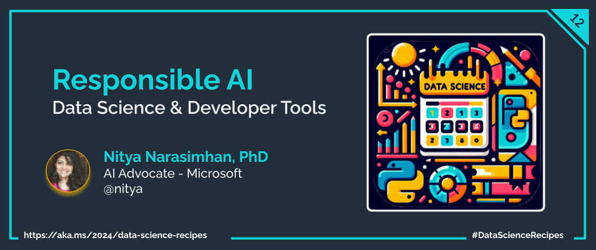

Welcome to `Day 05` of **Developer Tools Week** as we continue our learning journey into Data Science! Today, we'll dive deeper into the concepts of data ethics and a responsible AI. And we'll explore an open-source toolkit and its Azure-integrated solution, for debugging your models and decision-making processes for responsible AI.

## What We'll Learn
1. What are Data Ethics and Responsible AI?
1. Operationalize Responsible AI with an [open-source toolbox](https://responsibleaitoolbox.ai/)
1. Use Responsible AI Dashboard to [debug your tabular model](https://azure.github.io/responsible-ai-hub/docs/rai-dashboard-ms-learn/) 
1.  Use Responsible AI Dashboard to [debug your text model](https://github.com/microsoft/responsible-ai-toolbox/blob/main/notebooks/responsibleaidashboard/text/responsibleaidashboard-question-answering-model-debugging.ipynb)
1. **Assignment**: Explore the [Responsible AI Developer Hub](https://azure.github.io/responsible-ai-hub/)
1. **Resources**: Explore the [2024: Data Science Day Collection](https://bit.ly/2024-datasci-collection)

---

---