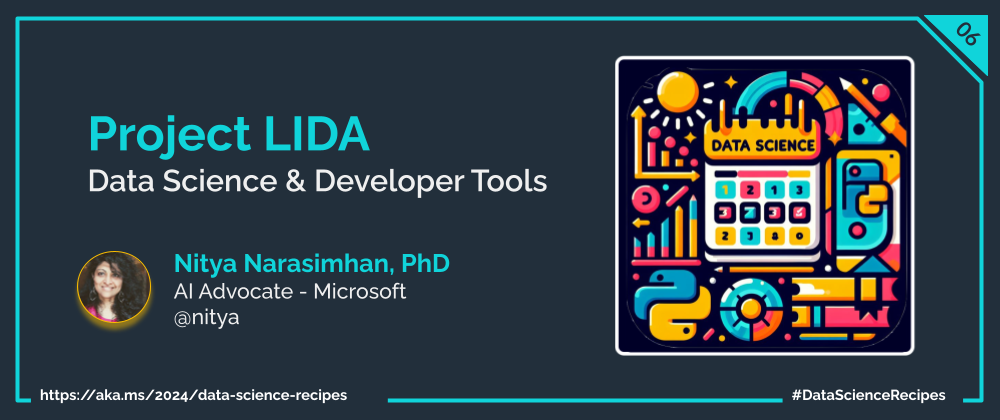

Welcome to `Day 06` of **Developer Tools Week** as we continue our learning journey into Data Science! Today, we'll talk about the challenges of building your data science _intuition_ using AI assistance with the LIDA project.

## What We'll Learn
1. What is the Microsoft LIDA project?
1. AI-assisted intuition for Goal Setting
1. AI-assisted suggestions for Data Visualization
1. Build custom visualizations with LIDA
1. **Assignment**: Explore the [Responsible AI Developer Hub](https://azure.github.io/responsible-ai-hub/)
1. **Resources**: Explore the [2024: Data Science Day Collection](https://bit.ly/2024-datasci-collection)

---

---