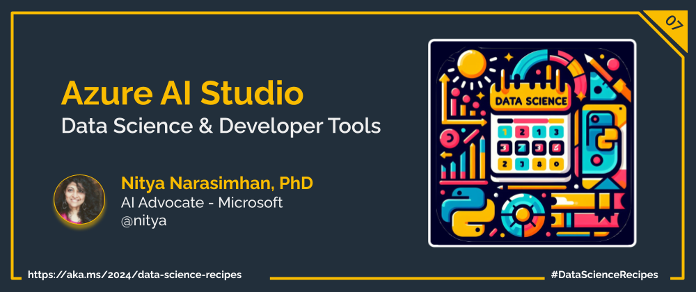

Welcome to `Day 07` of **Developer Tools Week** as we continue our learning journey into Data Science! Today, we'll wrap the week by discussing the paradigm shift from MLOps to LLMOps, in the new landscape of generative AI. And we'll look at how the Azure AI Studio platform provides low-code and code-first options to streamline end-to-end development.

## What We'll Learn
1. What is LLM Ops?
1. What is Azure AI Studio?
1. What is Prompt flow?
1. Build an End-to-End Copilot on Azure AI.
1. **Assignment**: Explore the [Contoso Chat](https://aka.ms/aitour/contoso-chat) sample
1. **Resources**: Explore the [2024: Data Science Day Collection](https://bit.ly/2024-datasci-collection)

---

---