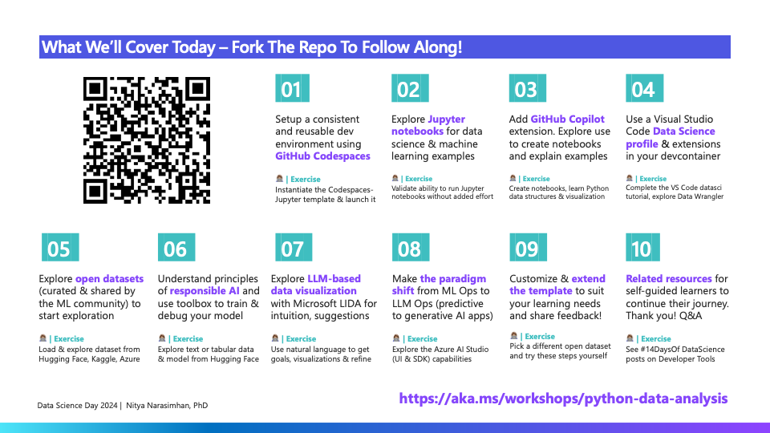

## Table Of Contents: Week 2

Welcome to week 2 of the data science learning journey. This week, we'll focus on the developer experience as you progress through the data science lifecycle (to build models) and introduce the paradigm shift to LLM Ops when exploring generative AI solutions that work with Large Language Models (LLMs). Each day this week, we'll introduce a tool, platform or resource that can help _streamline_ your end-to-end workflow.

| Day | Topic | Description |
|:---|:---|:---|
| 1️⃣ | [**GitHub Codespaces**](./1-codespaces.md) | Pre-built & reproducible dev environments for productivity |
| 2️⃣ | [**Visual Studio Code**](./2-vscode.md) | Enhanced & shareable profiles for consistency, collaboration |
| 3️⃣ | [**GitHub Copilot**](./3-github-copilot.md) | Focused learning with AI-assisted coaching and exploration |
| 4️⃣ | [**Open Datasets**](./4-open-datasets.md) | Learn from OSS communities like Kaggle & Hugging Face |
| 5️⃣ | [**Responsible AI**](./5-responsible-ai.md) | Explore the toolkit for model debugging and decision making |
| 6️⃣ | [**Project LIDA**](./6-project-lida.md) | Explore tools for AI-assisted data visualization & summarization |
| 7️⃣ | [**Azure AI Platform**](./7-azure-ai.md) | Make the paradigm shift to LLM Ops with a unified platform |
| | | |

## Data Science Day 

March 14, 2024 (3.14) was **Pi Day** aka [Data Science Day](https://devblogs.microsoft.com/python/python-data-science-day/) at Microsoft - a full-day of talks from Python enthusiasts and experts from Microsoft and the broader community. You can check out the livestream here for all the talks:

<iframe width="800" height="600" src="https://www.youtube.com/embed/scvDXfCMHYU" title="Python Data Science Day" frameborder="1"  allowfullscreen></iframe>

## Simplifying Data Analysis with Developer Tools & AI

I presented a talk on **Simplifying Data Analysis with Developer Tools & AI** targeting the _non-Python developer_. My target audience was someone new to Python or Data Science, but otherwise experienced in development. And my goal was to provide a learning roadmap _and quickstart environment_ so they could get productive quickly in their data science journey. You can check out my talk slides here - and you can watch the talk [starting at the 1:02 mark ](https://youtu.be/scvDXfCMHYU?t=3770) Python Data Science Day livestream.

In that talk, I outlined the following roadmap for developers new to this topic, to structure their learning journey but also create a reusable, shareable and reproducible development environment for producitivity. Each of the steps has an associated _Exercise_ that can take developers from conceptual understanding to hands-on practice.

In Week 2 of #14DaysOfDataScience, I'll be publishing one post a day focused on one of these tools, with a link to the associated hands-on exercise. You can get a head-start on this by forking the repository identified in the roadmap at [https://aka.ms/workshops/python-data-analysis](https://aka.ms/workshops/python-data-analysis) - then check back for the daily posts to guide you through the exercises.

## Learning Resources

Check out these resources for self-guided exploration of related topics.
1. [2024: Data Science Day Collection](https://bit.ly/2024-datasci-collection) - Skill up on Data Science Tools & Techniques
1. [2024: Responsible AI for Developers](https://aka.ms/rai-hub/collection) - Skill up on Responsible AI Principles & Tooling
1. [2024: Generative AI Code-First on Azure](https://aka.ms/ai-studio/collection) - Build Generative AI Apps End-to-End with Azure AI
