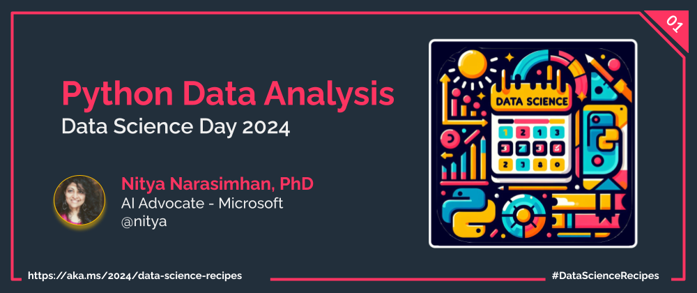

## Table Of Contents: Week 2

Welcome to week 2 of the data science learning journey. This week, we'll focus on the developer experience as you progress through the data science lifecycle (to build models) and introduce the paradigm shift to LLM Ops when exploring generative AI solutions that work with Large Language Models (LLMs). Each day this week, we'll introduce a tool, platform or resource that can help _streamline_ your end-to-end workflow.

| Day | Topic | Description |
|:---|:---|:---|
| 1️⃣ | [**GitHub Codespaces**](./1-codespaces.md) | Pre-built & reproducible dev environments for productivity |
| 2️⃣ | [**Visual Studio Code**](./2-vscode.md) | Enhanced & shareable profiles for consistency, collaboration |
| 3️⃣ | [**GitHub Copilot**](./3-github-copilot.md) | Focused learning with AI-assisted coaching and exploration |
| 4️⃣ | [**Open Datasets**](./4-open-datasets.md) | Learn from OSS communities like Kaggle & Hugging Face |
| 5️⃣ | [**Responsible AI**](./5-responsible-ai.md) | Explore the toolkit for model debugging and decision making |
| 6️⃣ | [**Project LIDA**](./6-project-lida.md) | Explore tools for AI-assisted data visualization & summarization |
| 7️⃣ | [**Azure AI Platform**](./7-azure-ai.md) | Make the paradigm shift to LLM Ops with a unified platform |
| | | |

## Data Science Day Talk

March 14, 2024 (3.14) is **Pi Day** aka [Data Science Day](https://devblogs.microsoft.com/python/python-data-science-day/) at Microsoft. The event will consist of a number of talks (live and pre-recorded) covering a variety of topics of interest to the data science audience. I'll be presenting a talk on **Simplifying Data Analysis with Developer Tools & AI** for the _non-Python developer_. 

The goal was to allow someone who was experienced in development, but new to Python and Data Science, to jump in and start being productive with data. The Week 2 series of posts dives into the core set of tools that I will cover in that talk. Check back later for a link to the talk recording for reference.

## Learning Resources

Check out these resources for self-guided exploration of related topics.
1. [2024: Data Science Day Collection](https://bit.ly/2024-datasci-collection) - Skill up on Data Science Tools & Techniques
1. [2024: Responsible AI for Developers](https://aka.ms/rai-hub/collection) - Skill up on Responsible AI Principles & Tooling
1. [2024: Generative AI Code-First on Azure](https://aka.ms/ai-studio/collection) - Build Generative AI Apps End-to-End with Azure AI
